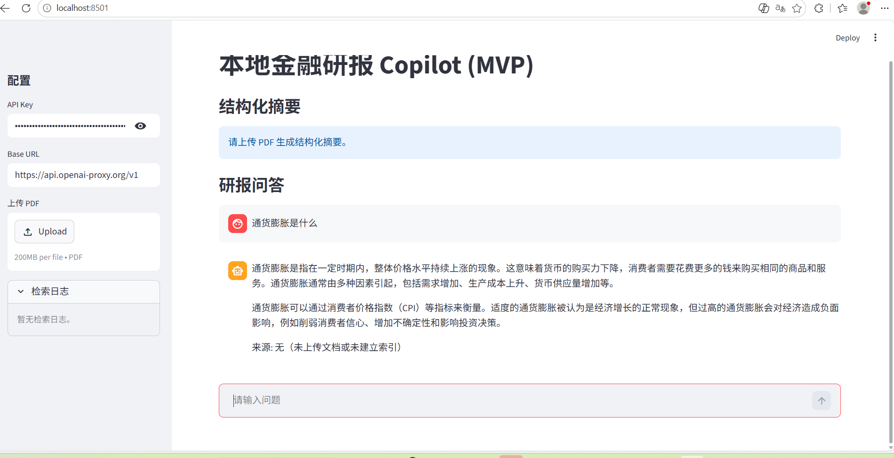
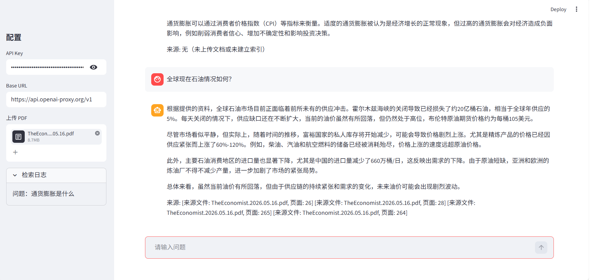
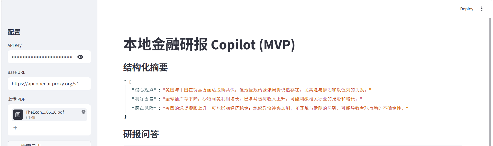

# 测试样例

已准备材料：
- 示例研报：TheEconomist.2026.05.16.pdf:经济学人2026 年 5 月 16 日刊（用于用例 2/3 的上传与索引）

## 用例 1：通用问答（无 PDF）
- 前置条件：应用已启动，API Key 与 Base URL 已填入；当前演示环境未上传 PDF
- 输入："什么是通货膨胀？"
- 期望结果：
  - 助手给出通用解释
  - 来源区显示无文档（例如："来源: 无（未上传文档或未建立索引）"）
  

## 用例 2：RAG 问答（有 PDF）
- 前置条件：已使用我们准备的示例研报(TheEconomist.2026.05.16,经济学人2026 年 5 月 16 日刊)完成上传与索引
- 输入："全球现在石油情况如何？"
- 期望结果：
  - 助手基于研报内容作答
  - 来源列表包含 PDF 文件名与页码!
  

## 用例 3：结构化摘要
- 前置条件：已使用我们准备的示例研报（TheEconomist.2026.05.16,经济学人2026 年 5 月 16 日刊）完成上传与索引
- 输入：无（摘要自动生成）
- 期望结果：
  - UI 展示 JSON，且包含字段："核心观点"、"利好因素"、"潜在风险"
  - JSON 之外不应出现额外文本
  